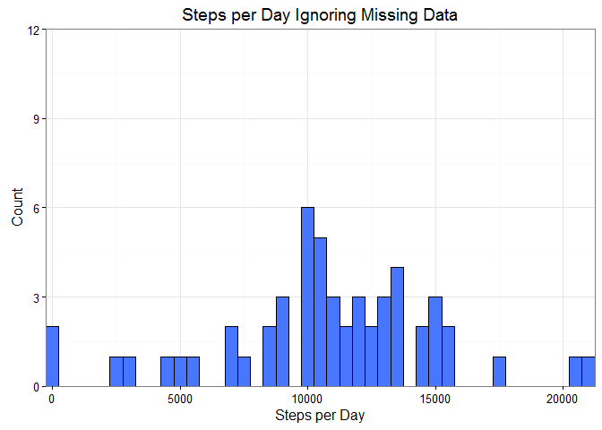
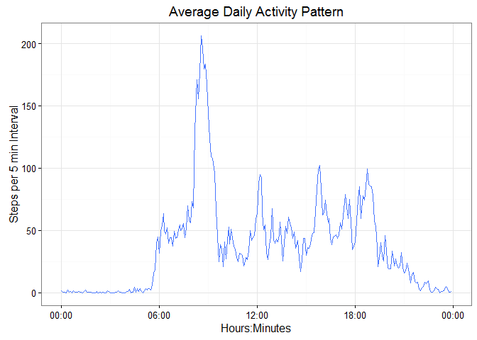
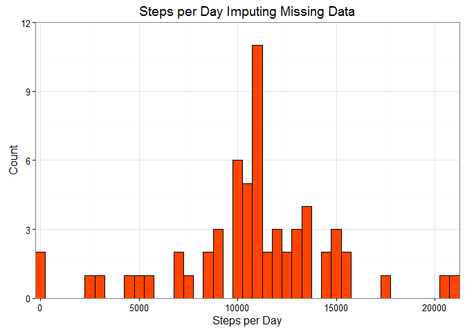
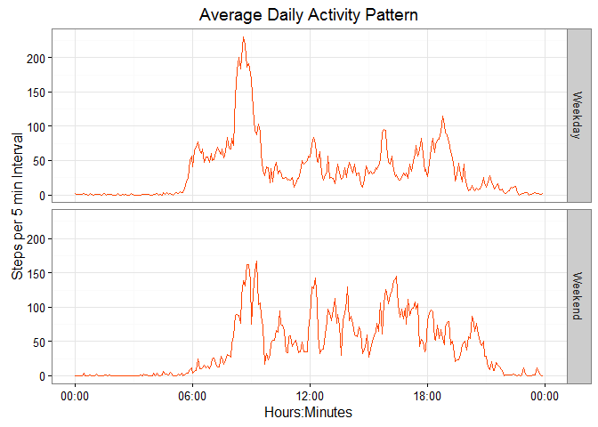

# Personal Activity Monitoring Device - Step Analysis

##Objective
Step counts from a personal monitoring device such as "fitbit" were analyzed. Average daily activity, within-day activity and weekday/weekend step activity are reported.

The source data for this project is located at:
https://d396qusza40orc.cloudfront.net/repdata%2Fdata%2Factivity.zip
The filename is "activity.csv".

##1. Load Data and Preprocess

The variable 'interval' is represented by military clock time over 24 hours.  'date' and 'interval' were combined to create datetime in POSIXct class which is more suitable for data frames and time series plotting.


```r
## Libraries needed for analysis
library(lubridate)
library(stringr) 
library(dplyr)
library(ggplot2)

## Put datetime in POSIXct class for time series plotting
        setwd("~/Telematics and Analytics/Statistics/Data Science Specialization/Reproducible Research/week2/project")
        df1 <- read.csv("activity.csv", stringsAsFactors = FALSE)
        df1$stamp <- strptime(paste(df1$date,str_pad(as.character(df1$interval),
                4,pad="0")), "%Y-%m-%d %H%M", tz="")
        df1$stamp <- as.POSIXct(df1$stamp)
```

##2. Steps per Day Ignoring Missing Data: Mean, Median and Histogram

The data had missing 'step' values denoted by NA. The code below accounts for the possibility that 'step' NA values could occur for partial days. Data exploration confirmed there were no records that had 0 steps. The histogram below summarizes the total number of steps taken each day over the two month test period.  The histogram excludes days where no steps were reported for the entire day.  

```r
## Group by date and sum
        df2 <- group_by(tbl_df(df1), date)
        step_day <- summarize(df2, sum=sum(steps, na.rm=TRUE))
        step_day$sum[step_day$sum == 0] <- NA
        step_day_mean <- mean(step_day$sum, na.rm = TRUE)
        step_day_med <- median(step_day$sum, na.rm = TRUE)
      
        g2 <- ggplot(step_day, aes(sum)) +
                geom_histogram(binwidth=500, na.rm = TRUE, color="black", fill="royalblue1") +
                labs(x="Steps per Day", y="Count") +
                labs(title="Steps per Day Ignoring Missing Data") +
                coord_cartesian(ylim = c(0, 12), expand=FALSE) +
                theme_bw()
        print(g2)
```

<!-- -->

Mean and median values are simply:

```r
        step_day_mean <- mean(step_day$sum, na.rm = TRUE)
        step_day_med <- median(step_day$sum, na.rm = TRUE)
```
The mean number of steps taken daily was 10766, and the median number of steps was 10765.  The mean and median values were very close in value for this dataset, suggesting a normal distribution.

##3. Average Daily Activity Pattern: Average Steps per Interval

The average steps were calculated for each 5 minute time interval. Plotting that directly uses the 'interval' values is incorrect because plot display intervals are not uniform (interval value 655 jumps to 700 for instance which suggests a 45 minute gap). To overcome this issue, POSIXct was used for the time scale to ensure proper plotting in ggplot2. The timezone must not be left blank because it effects the x-axis label values and must be specified to avoid timezone offset issues.    

```r
## Group and average by interval
        df3 <- group_by(tbl_df(df1), interval)
        step_int <- summarize(df3, avg=mean(steps, na.rm=TRUE))
## Find maximum value and time over the intervals
## and format time for plotting and reporting        
        i <- which.max(step_int$avg)
        step_int_max <-  step_int$avg[i]
        step_int$stamp <- strptime(str_pad(as.character(step_int$interval), 
                4,pad="0"), "%H%M", tz="GMT") ##tz important for plot x scale
        step_int$stamp <- as.POSIXct(step_int$stamp)
        h <- hour(step_int$stamp[i])
        m <- minute(step_int$stamp[i])
        step_int_max_time <- paste(h,m,sep=":")

        g3 <- ggplot(step_int, aes(stamp, avg)) +
                geom_line(color="royalblue1") +
                scale_x_datetime("Hours:Minutes", date_labels = "%H:%M") +
                labs(y="Steps per 5 min Interval") +
                labs(title="Average Daily Activity Pattern") +
                theme_bw()
        print(g3)
```

<!-- -->

The maximum number of steps that occurred over the 5 minute intervals was 206 and occurred at 8:35 military time (in the morning). 

##4. Steps per Day with Imputed Data: Mean, Median and Histogram 
Missing values were designated as NA in the dataset. The total number of missing values is summarized in the table below. 


```r
##     Tabulate Missing Data        
        m1 <- sum(is.na(df1$steps))      
        m2 <- sum(is.na(df1$date))             
        m3 <- sum(is.na(df1$interval))
        m4 <- sum(is.na(step_day$sum))
        n1 <- "Step Records"
        n2 <- "Date Records"
        n3 <- "Interval Records"
        n4 <- "Complete Days with Missing Steps"
        mnames <- c(n1,n2,n3,n4)
        missing <- c(m1,m2,m3,m4)     
        df_missing <- as.data.frame(cbind(mnames,missing))
        names(df_missing) <- c("MISSING DATA ITEM", "SUM OF MISSING VALUES")
        print(df_missing)
```

```
##                  MISSING DATA ITEM SUM OF MISSING VALUES
## 1                     Step Records                  2304
## 2                     Date Records                     0
## 3                 Interval Records                     0
## 4 Complete Days with Missing Steps                     8
```

Due to the substantially large number of missing step records, imputation was used to replace the NA values.  Missing step records were imputed by using the average steps for the cooresponding time interval. The average steps for that interval were determined by looking up values from the 'step_int$avg' data frame from Step 3.


```r
##     Impute missing step records by using the average steps for the interval
##     Lookup average values from step_int$avg
        df4 <- df1
        for(j in 1:length(df4$steps)) {
                if(is.na(df4$steps[j]) == TRUE) {
                        k <- which(step_int$interval == df4$interval[j])
                        df4$steps[j] <- step_int$avg[k]
                        }
                }

##     Repeat Calculations                
        df4a <- group_by(tbl_df(df4), date)
        istep_day <- summarize(df4a, sum=sum(steps, na.rm=TRUE))

        
        g4 <- ggplot(istep_day, aes(sum)) +
                geom_histogram(binwidth=500, na.rm = TRUE, color="black", fill="orangered1") +
                labs(x="Steps per Day", y="Count") +
                labs(title="Steps per Day Imputing Missing Data") +
                coord_cartesian(ylim = c(0, 12), expand=FALSE) +
                theme_bw()
        print(g4)          
```

<!-- -->

The histogram above can be compared directly with the histogram in Step 2, because the same y-axis scaling was used.  8 more "counts" appear in the 11000 step bin, because 8 days of NA values were replaced with averaged step data.
        
The mean and median values for the dataset with imputed data are simply:     

```r
        istep_day_mean <- mean(istep_day$sum, na.rm = TRUE)
        istep_day_med <- median(istep_day$sum, na.rm = TRUE)
```

The mean number of steps taken daily was 10766, and the median number of steps was 10766.  The mean and median values are essentially unchanged when adding the imputed data, because average steps were used for the imputation.

##5. Activity Patterns Between Weekdays & Weekends 

Weekday and weekend activity patterns were compared.  Weekdays and Weekends were determined from the POSIXct datetime stamp. The analysis was repeated using two nested groups with dplyr: interval and weekday/weekend. From the graph displayed, on average there were marked differences between weekday and weekend activity.  


```r
## Add weekend - weekday factor
        df4$wd <- 0
        for(q in 1:length(df4$stamp)) {
                if(wday(df4$stamp[q]) == 1 | wday(df4$stamp[q]) == 7) {
                        df4$wd[q] <- "Weekend"
                        }
                else {
                        df4$wd[q] <- "Weekday"
                        }
                }        
        df4$wd <- as.factor(df4$wd)

## Calculate means for interval and weekday/weekend groups      
        df5 <- group_by(tbl_df(df4), interval, wd)
        istep_int <- summarize(df5, avg=mean(steps, na.rm=TRUE))
        istep_int$stamp <- strptime(str_pad(as.character(istep_int$interval), 
                4,pad="0"), "%H%M", tz="GMT") ##tz important for plot x scale
        istep_int$stamp <- as.POSIXct(istep_int$stamp)

        g5 <- ggplot(istep_int, aes(stamp, avg)) +
                geom_line(color="orangered1") +
                scale_x_datetime("Hours:Minutes", date_labels = "%H:%M") +
                facet_grid(wd ~ .) +
                labs(y="Steps per 5 min Interval") +
                labs(title="Average Daily Activity Pattern") +
                theme_bw()
        print(g5)  
```

<!-- -->

```r
## End        
```
